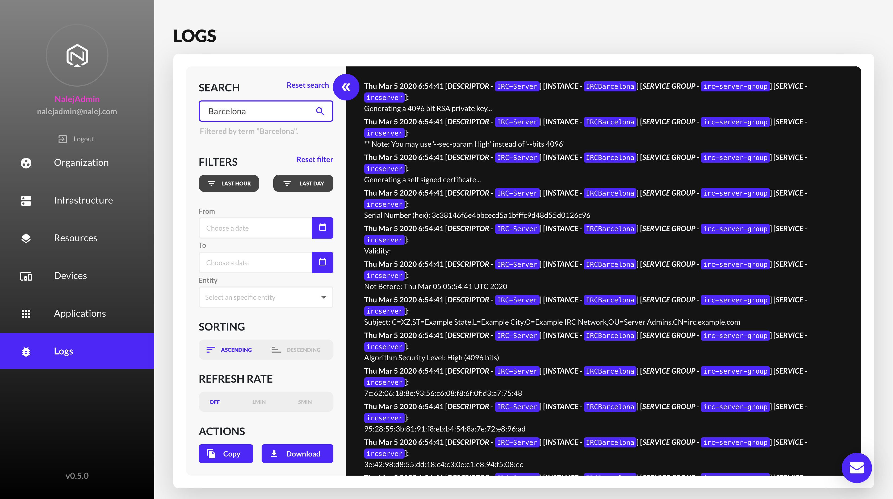
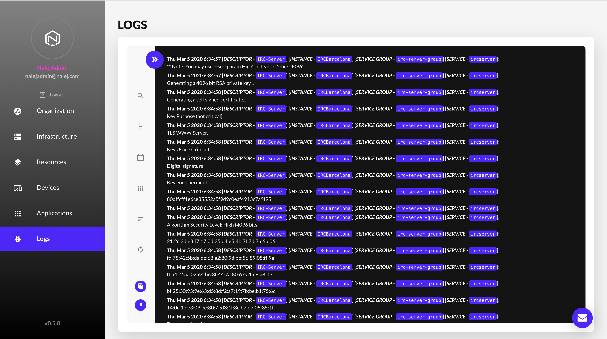
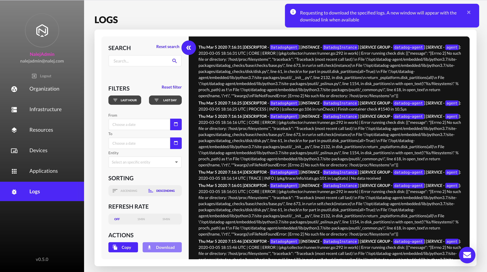
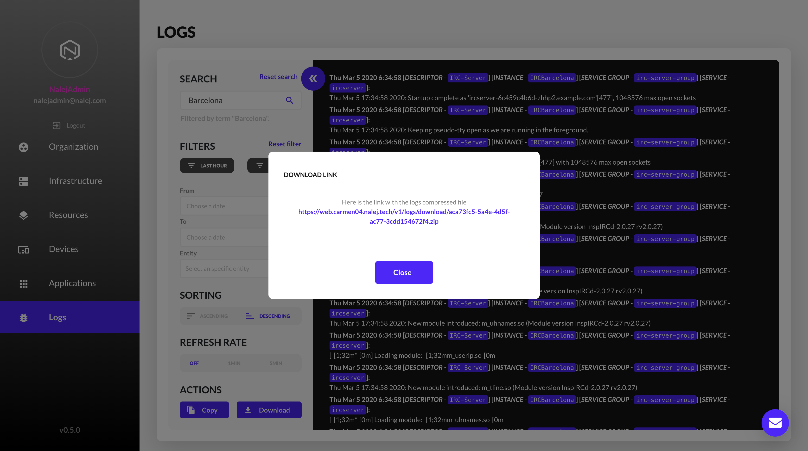

# The Unified Logging

So, you have an application instance running in Nalej platform, with several services in several service groups executing across several clusters. And then something goes wrong.

You are sure it's just a little \(and solvable\) error, but you have no way of knowing that for sure unless you check the instance logs. The only problem is that the logs are scattered through all the clusters where the application instance is executing, and it's impossible to know where the error might be hiding. What to do? Well, ask the **unified logging** feature, of course.

## What is **Unified Logging**?

**Unified logging** is a feature that retrieves all the logs generated by an instance in all the clusters, and presents them in a neat list. From that list, we can filter the logs by service group or by a _filter string_.

When the app instance is undeployed, the system deletes all the associated logs, so please be sure to check it while it is in the system!

## How do I use it?

This feature is accessible through the Public API CLI and the Web Interface, as usual. 

### Web Interface

The Logs view can be found at the very end of the list in the far left side of the screen.


Here you can find the logs of all the instances deployed in the organization you belong to. This is obviously unmanageable by itself, so we provide several tools to find your way through it. 

On the left side of the logs (which are in dark background) , you can find the **search and filters** menu. The **Search** option uses a _string_ as a parameter, and looks for that _string_ in the logs, the name of the services, instances and applications, the IDs... basically everywhere.

 

Beside the "Reset search" link there is a button with the symbol **<<**. Clicking on it will minimize the search and filter menu, and give all the spotlight to the logs section.



Clicking again in the same button, or in any of the menu icons, will restore the menu to its normal size, so you can interact with it comfortably.

You can also filter the log messages that come up by asking only for the messages from the last hour or from the last day, or choosing a specific period of time, or choosing the entity that generated them.

Another option is, once you have filtered your logs (or not), you can arrange them to have the oldest first (ascending) or the newest first (descending).

The refresh rate can also change, being **OFF** by default (whenever a log is generated, it appears on the screen), to intervals of 1 minute or 5 minutes.

Lastly, there are two main actions that can be done with this information.

- you can **copy** the logs to the clipboard, and then paste them wherever you deem appropriate.

- you can **download** the logs. This option will generate a downloadable file in the server. Depending on the size of the file, it may take a while to generate. The platform will announce it like this:

  

  After that time, a dialog with a link will appear in the middle of the screen, allowing you to download it.

  

### Public API CLI

First you need to connect to the server with the Public API CLI and obtain the instance ID, which can be done with:

```bash
./public-api-cli app instance list
```

This will return a list of all the instances deployed in the server. Find yours, and copy its `instanceID`. Then, to see the logs associated to it, execute:

```bash
./public-api-cli log search 
    --instanceID <inst_id>
```

All the logs associated to this instance will appear in a text table, with the timestamp and message, like so:

```bash
TIMESTAMP    
2019-06-21 10:29:58.593 +0200 CEST  

MSG
{"level":"info", "time":"2019-06-21T08:29:58Z", "message":"alive"}
```

This can be overwhelming, since the application may have several services running and the quantity of the messages can be daunting. Not to worry, because we can filter the logs by a _filter string_. For example, we could look for errors in the application:

```bash
./public-api-cli log search 
    --instanceID <inst_id>
    error
```

This command will only return the logs with the word "error" in it, which can be very useful when we need information about why something has stopped working properly.

### Flags to add

#### Filter by service group

We have many options to organise the logs and make their processing easier. One of them is to **filter by service group**. To do this, we need the `service_group_instance_id` parameter, which is a bit difficult to obtain. We need the `instance_id` that we can get from the `app instance list` command. Then, once we have that, we execute:

```bash
./public-api-cli app instance get 
    <inst_id>
    --output json
```

The `--output json` parameter is important, since we need to dig into the application descriptor of this instance to find what we're looking for. So, this command will print a modified version of the application descriptor we uploaded for our application, with the IDs we need to know. After the `rules` part, when we get to the `service_groups` section, we find something like this:

```javascript
"groups": [
    {
      "organization_id": <org_id>,
      "app_descriptor_id": <app_desc_id>,
      "app_instance_id": <app_inst_id>,
      "service_group_id": <serv_group_id>,
      "service_group_instance_id": <serv_group_inst_id>,
      "name": "core",
      "service_instances": [
        {
            "organization_id": <org_id>,
            "app_descriptor_id": <app_desc_id>,
            "app_instance_id": <app_inst_id>,
            "service_group_id": <serv_group_id>,
            "service_group_instance_id": <serv_group_inst_id>,
          "service_id": <serv_id>,
          "service_instance_id": <serv_inst_id>,
          ...
```

What we need is to find the service group we need, and then get the `service_group_instance_id` parameter associated to it. Once we have it, the `log search` command changes to:

```bash
./public-api-cli log search 
    --instanceID <inst_id>
    --sgInstanceID <sg_inst_id>
    error
```

This way we obtain only the error logs from that service group, which can be interesting in case we have configured different service groups for different clusters, for example.

#### Temporal filtering

We can also find log messages given a certain period of time. For example, if we know that the logs we're looking for happened in some moment in a specific month, we could indicate that with:

```bash
./public-api-cli log search 
    --instanceID <inst_id>
    warning
    --from 2019-06
    --to 2019-07
```

This command will return all the warning messages in the logs in June 2019.

Of course we can get into more detail with this, if we need logs from the past hour we could specify it like so:

```bash
./public-api-cli log search 
    --instanceID <inst_id>
    warning
    --from "2019-06-20 13:00"
```

This will return all the warning messages written in the logs of this instance from that specific hour until now. We could, similarly, obtain all the logs written until a specific time, with `—to` instead of `—from`.

If we want to read the latest logs, we just have to execute the base command \(with the `instanceID` and the _filter string_\), since it will return the latest logs last. In case we want to specify this behavior, which is the default, the flag to do so would be `—asc`.

```bash
./public-api-cli log search 
    --instanceID <inst_id>
    warning
    --asc
```

If, on the contrary, we know something might have happened while deploying, and we want to check those logs, we would want to read the first logs written in the system, not the last ones. That can be done with `—desc`.

```bash
./public-api-cli log search 
    --instanceID <inst_id>
    warning
    --desc
```

#### Redirecting to the CLI log

Lastly, we can redirect the logs generated by our instance to the CLI log, to register them and make them more permanent \(remember that the logs generated by a given instance will be erased once the instance is undeployed\). To do so, the flag to use would be `—redirectResultAsLog`, and it would be used like this:

```bash
./public-api-cli log search 
    --instanceID <inst_id>
    error
    --from 2019-06
    --to 2019-07
    --redirectResultAsLog
```

This command would save in the CLI log the log messages from our application instance that contain the word "error" and are generated during the month of June 2019.

In case you struggle to remember the specific flags you need, `—help` will print out a handy guide to help you remember, as always.

