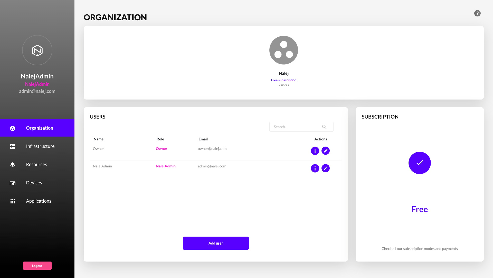
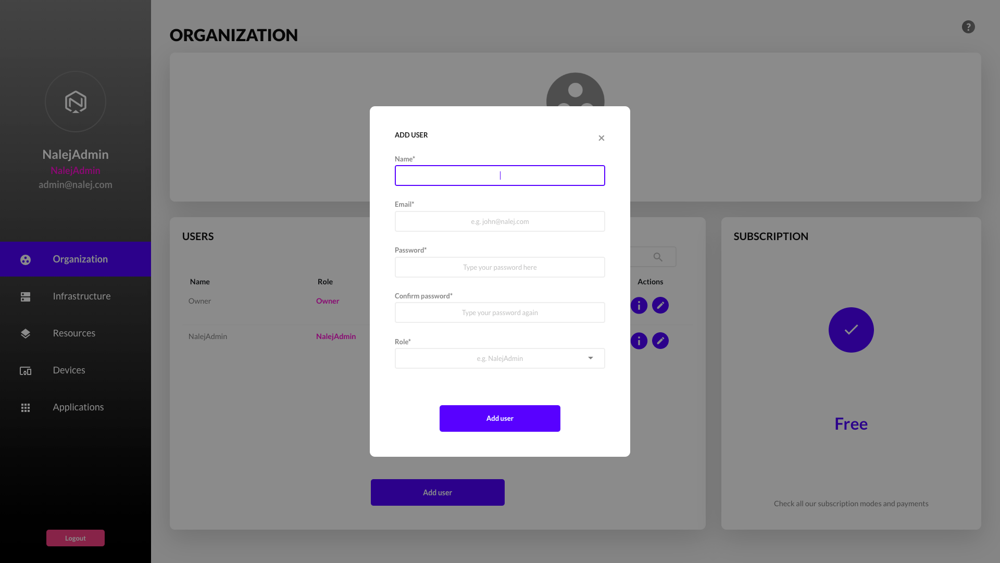
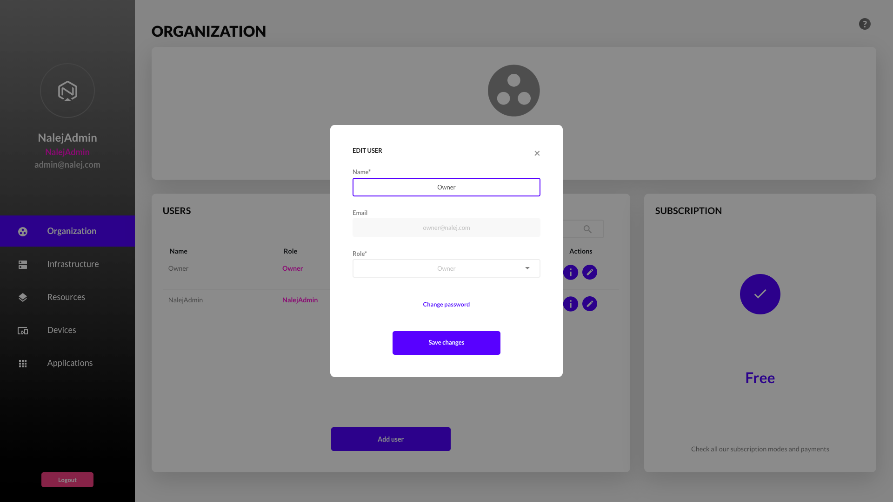
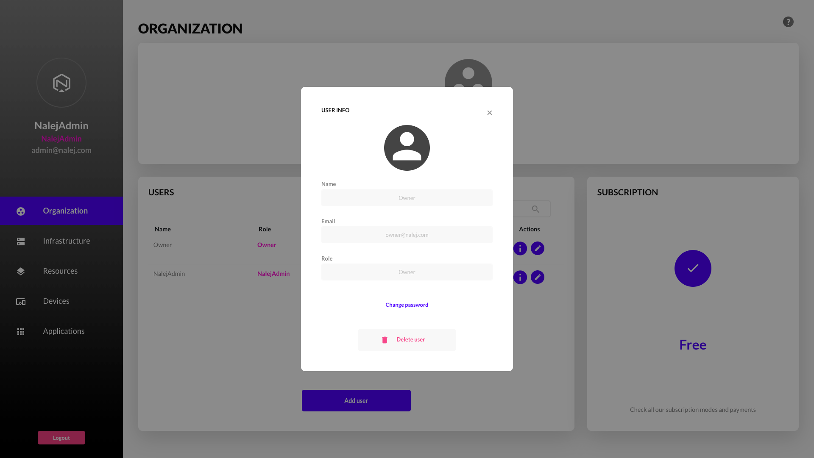
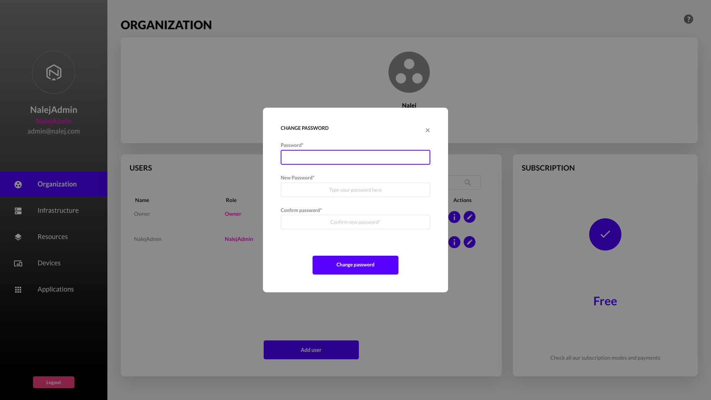
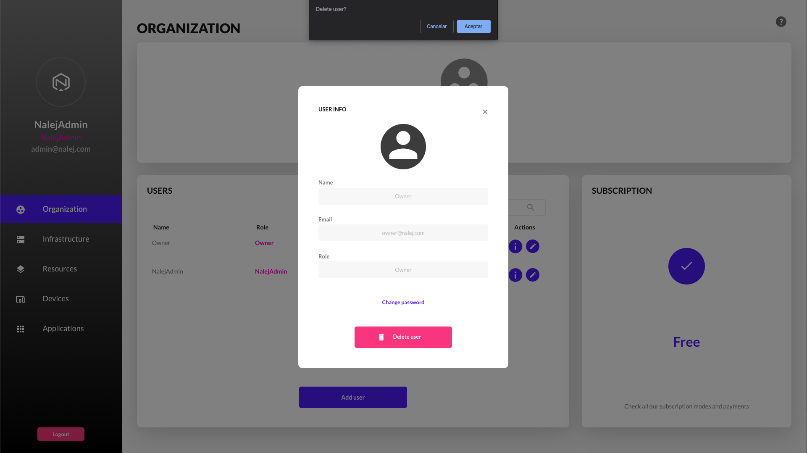

# Organization and user management

Here you will find all there is to know about user management, role management and organization information.

The Organization area contains all the information related to the organization and the management of its members. In this area you will be able to create, manage and delete users, as well as assign them different roles in the platform and create new roles if necessary.

_The CLI responses are shown in text format, which can be obtained adding_ `--output="text"` _to the user options. If you need the responses in JSON format, you can get them by adding_ `--output="json"` _at the end of your requests, or as a user option._

## Getting the organization information

### Web Interface

The Organization view is the first view presented to you after logging in. Just in case you have been navigating around, you only have to click the "Organization" menu option on the left column to go back to it.



Here, the information we can see depends on the role we have been assigned, and so, if the person logging in is categorized as Owner of the organization, the info shown is this:

* **Organization info card**. Here you can see the most relevant information related to the company: name, type of subscription, and number of members.
* **Subscription**. The subscription plan the company is currently on.
* **Member list**. Here you can find all the members in your organization, with their name, role and email, and some actions you can do:
  * _Info_: this button shows the member card, and gives us the option of resetting the password and deleting the user.
  * _Edit_: here we can edit the member name, change the password, and edit the role this person has.

### Public API CLI

The only organization information we can see through the Public API CLI is the organization name and ID. To check this, the command you can use is:

```bash
./public-api-cli org info
```

which returns the following:

```bash
ID                 NAME
<org_id>           <org_name>
```

## Creating users

You need to be an Owner of the organization to be able to create, manage or delete a user.

### Web Interface

In the Organization view, under the "Member list" there is an **"Add user"** button. If we click on that, a form appears.



By now, the form to sign a user up requires a name, an email, a password and a role. You can save the information (thus creating a user) or discard it. You can also discard the information by clicking the cross in the upper right corner.

### Public API CLI

Once you log in the system, the command you need is `users`. These are the actions you can take with it:

* **Add**: creates a new user.
* **Info**: gets user info.
* **List**: lists users.
* **Reset-password**: resets user's password.
* **Update**: updates user info.
* **Del**: deletes a user. 

To create a new user, the command you need would look like this:

```bash
./public-api-cli users add 
    --name=<newuser_name> 
    --password=<newuser_password> 
    --role=<newuser_role_name> 
    --email=<newuser_email-name>@<email-domain>
```

The response to this command would look like this:

```bash
NAME             ROLE                 EMAIL
<user_name>   <user_role_name>   <user_email>
```

where the **email** is the parameter we will use to locate the user in future interactions. For example, if we want to obtain the info related to a specific user, we would need to know their email, like so:

```bash
./public-api-cli users info 
    --email=<email-name>@<email-domain>
```

The response to this command would be the same we received when creating the user, with their current information. If we don't add the `--email` parameter, the info returned would be our own.

## Editing users

There are several operations you can do with the members who belong to your organization, if you're the Owner.

### Web interface

In the Member list, you can click on the Edit button of the user you want to edit. The following page appears:



As you can see, the editable fields here are the user's name and role. We can also change the password if we know the current one.

Once we hit "Save", a notification message appears in the upper right corner of the browser, confirming the changes that have been made.

We can also reset their password, which means we send a default one to the email given when the user was created. To do this, click on the Info button of the user.



This shows the member card, and on it you can see the "Change password" button. To reset the password, click it.

A new form appears, where we can write the old password and the new one, and confirm the new one.



### Public API CLI

As you don't have an accessible list of users in plain view, the first thing you may want to do is to get one, so you know which users are actually in your organization. To do so, we will use the `users` command again:

```bash
./public-api-cli users list
```

The response to this is a JSON with a list of the users in your organization, and their info:

```javascript
NAME          ROLE        EMAIL
<name1>       <role1>     <email1>
<name2>       <role2>     <email2>
<name3>       <role3>     <email3>
<name4>       <role4>     <email4>
...
```

To edit a specific user's information, we need their email. With that we can:

* Update their name:

  ```bash
  ./public-api-cli users update 
      --name=<new_name> 
      --email=<email-name>@<email-domain>
  ```

* Reset their password \(we also need the current password for this\):
* ```bash
  ./public-api-cli users reset-password 
      --email=<email-name>@<email-domain> 
      --password=<password> 
      --newPassword=<newpassword>
  ```

  For this to work, the new password must not be empty.

When these operations are successful, the return is an acknowledgment that the operation is done, like:

```bash
RESULT
OK
```

## Deleting users

### Web Interface

To delete a user, click on the Info button of that user.



Once in this screen, hit the "Delete user" button. A message will appear on the upper right part of the screen confirming the action.

### Public API CLI

To delete a user, execute the following command:

```bash
./public-api-cli users delete 
    --email=<email-name>@<email-domain>
```

When this operation exits successfully, the return is:

```text
RESULT
OK
```

