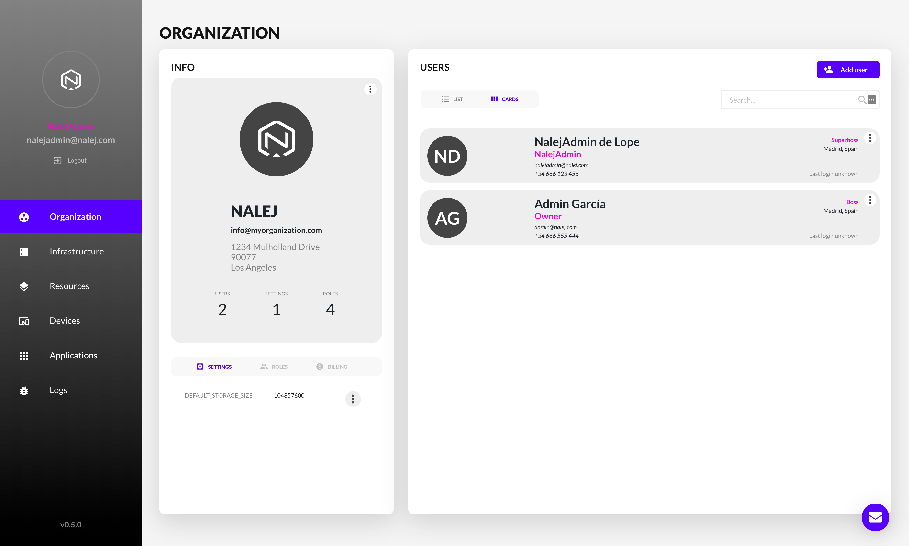
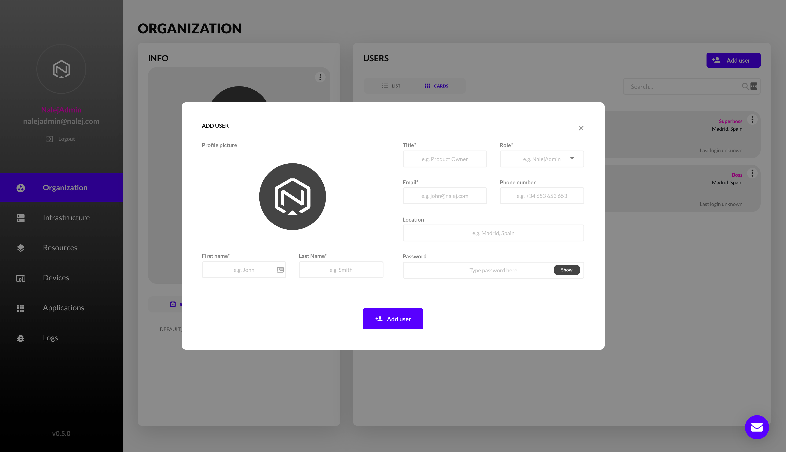
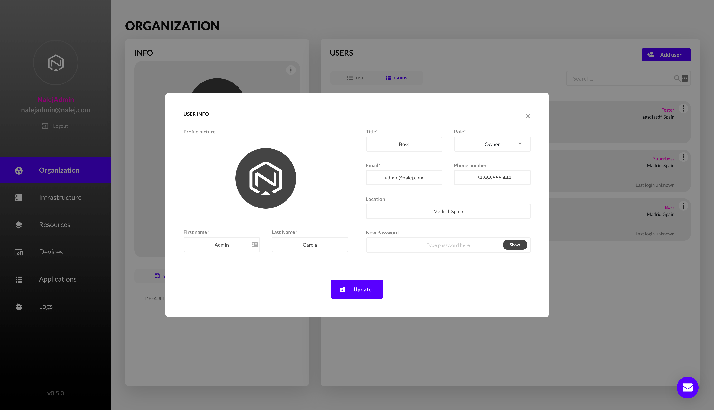
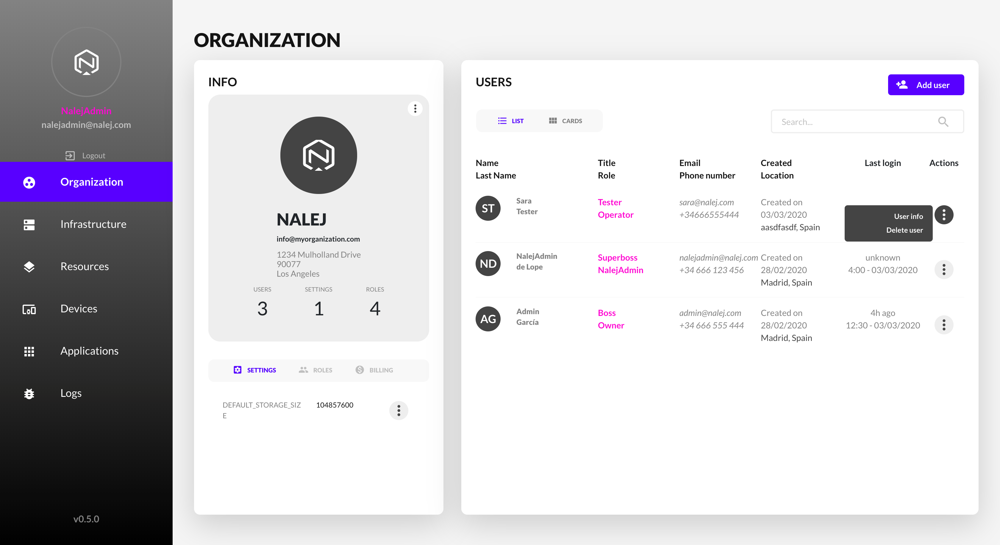

# Organization and user management

The Organization area contains all the information related to the organization and the management of its members. In this area you will be able to create, manage and delete users, as well as assign them different roles in the platform and create new roles if necessary.

_Attention CLI users:_

_The CLI responses are shown in text format, which can be obtained adding_ `--output="text"` _to the user options. If you need the responses in JSON format, you can get them by adding_ `--output="json"` _at the end of your requests, or as a user option._

## Getting the organization information

### Web Interface

The Organization view is the first view presented to you after logging in. Just in case you have been navigating around, you only have to click the "Organization" menu option on the left column to go back to it.



Here, the information we can see depends on the role we have been assigned, and so, if the person logging in is categorized as Owner of the organization, the info shown is this:

* **Organization info card**. Here you can see the most relevant information related to your company: name, address, contact email, number of members, default settings for the company's applications, and how may user roles are available. Under the **Info** card we can find another one where there are more details about the default settings and the roles, and we can see and modify them. Also, there's a section for the billing information, which is read-only.
* **Users**. Here you can find all the members in your organization, with their information: name, role, phone and email, and what their actual position in the company is and where they are located. 

In the contextual menu (with the three vertical buttons) we can find some actions to do:

* _User info_: this button shows the member card, and gives us the option of editing the user information (password included).
* _Delete user_: here we can delete the user from the system.

### Public API CLI

We can see the organization info through the Public API CLI with the command:

```bash
./public-api-cli org info
```

which returns the following:

```bash
ID         NAME         EMAIL
<org_id>   <org_name>   info@myorganization.com

ADDRESS                 CITY          STATE        COUNTRY   ZIP CODE
1234 Mulholland Drive   Los Angeles   California   USA       90077

NUM.USERS   NUM.ROLES   NUM.SETTINGS
3           4           1
```

Here we can find the same information displayed in the web interface, plus the ID: the name, email, complete address, the number of users in the organization, the number of roles available, and the default settings established for the applications in this company.

## Creating users

You need to be a **NalejAdmin** to be able to create or delete a user in the system. An **Owner** can update users and change passwords, but not create or delete users. 

### Web Interface

In the Organization view, under the "Member list" there is an **"Add user"** button. If we click on that, a form appears.



As is common in forms everywhere, the fields marked with an asterisk are compulsory. You can save the information (thus creating a user) or discard it. You can also discard the information by clicking the cross in the upper right corner.

### Public API CLI

Once you log in the system, the command you need is `users`. These are the actions you can take with it:

* **Add**: creates a new user.
* **Info**: gets user info.
* **List**: lists users.
* **Reset-password**: resets user's password.
* **Update**: updates user info.
* **Del**: deletes a user. 

To create a new user, the command you need would look like this:

```bash
./public-api-cli users add <newuser_email> <newuser_name> <newuser_password> <newuser_lastname> <newuser_role_name> <newuser_title> --location <newuser_location> --phone <newuser_phone> --photoPath <newuser_photopath>
```

The response to this command would look like this:

```bash

EMAIL            TITLE        NAME   LAST NAME   ROLE       LAST LOGIN   MEMBER SINCE
user@myorg.com   BetaTester   User   Smith       Operator   never        2020-03-03 12:47:31.563322369 +0100 CET
```

where the **email** is the parameter we will use to locate the user in future interactions. For example, if we want to obtain the info related to a specific user, we would need to know their email, like so:

```bash
./public-api-cli users info 
    --email=<email-name>@<email-domain>
```

The response to this command would be the same we received when creating the user, with their current information. If we don't add the `--email` parameter, the info returned would be our own.

## Editing users

There are several operations you can do with the members who belong to your organization, if you're the Owner.

### Web interface

In the Users list, you can click on the Info option of the user you want to edit. The following dialog appears:



We can edit any of the fields, even the password (which has a button to show or hide its characters while editing). Once we hit "Save", a notification message appears in the upper right corner of the browser, confirming the changes that have been made.

### Public API CLI

As you don't have an accessible list of users in plain view, the first thing you may want to do is to get one, so you know which users are actually in your organization. To do so, we will use the `users` command again:

```bash
./public-api-cli users list
```

The response to this is a JSON with a list of the users in your organization, and their info:

```shell
EMAIL                  TITLE       NAME         LAST NAME   ROLE         LOCATION           LAST LOGIN                                MEMBER SINCE
admin@myorg.com        Boss        Admin        García      Owner        Madrid, Spain      2020-03-03 12:30:47.598121981 +0100 CET   2020-02-28 10:41:37.994411567 +0100 CET
nalejadmin@myorg.com   Superboss   NalejAdmin   de Lope     NalejAdmin   Madrid, Spain      2020-03-04 07:12:35.087768309 +0100 CET   2020-02-28 10:41:37.828527405 +0100 CET
sara@myorg.com         Tester      Sara         Tester      Operator     Madrid, Spain                                             2020-03-03 12:47:31.563322369 +0100 CET
```

To edit a specific user's information, we need their email. With that we can:

Update their information:

```bash
./public-api-cli users update <email-name>@<email-domain> --lastName lastName --location NewCity, NewCountry --name newName --phone +00 123 456 789 --photoPath /path/to/new/photo --title newTitleInTheCompany
```

Reset their password \(we also need the current password for this\):

```bash
./public-api-cli users reset-password <email-name>@<email-domain> <newpassword>
```

For this to work, the new password must not be empty.

When these operations are successful, the return is an acknowledgment that the operation is done, like:

```bash
RESULT
OK
```

## Deleting users

### Web Interface

To delete a user, click on the **Delete user** option of that user's contextual menu.



A message will appear on the browser asking you to confirm the action and, after confirming, another message will appear on the upper right part of the screen acknowledging the deletion.

### Public API CLI

To delete a user, execute the following command:

```bash
./public-api-cli users delete 
    --email=<email-name>@<email-domain>
```

When this operation exits successfully, the return is:

```text
RESULT
OK
```

