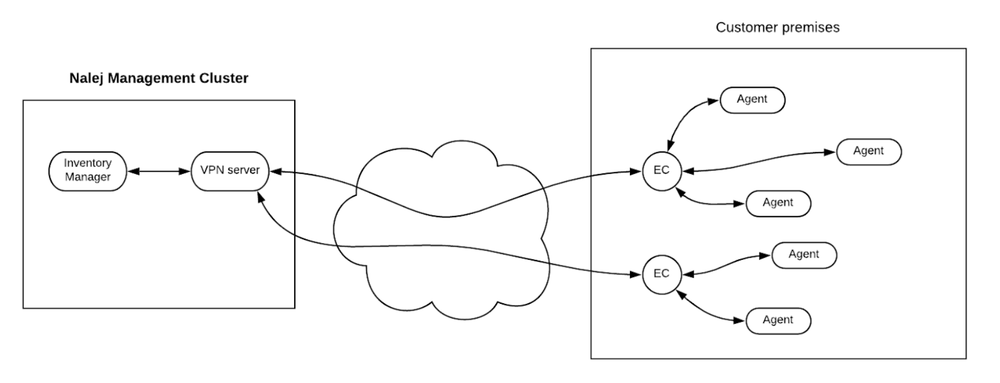

# The Inventory: what it is, and how it can help you

The Infrastructure section gathers all the information of what your company has in Nalej, and lets you see the information related to it.

## What is the Inventory?

The Inventory is the main view of the Infrastructure section. It consists of a list of the resources your organization has in the system. This list has:

- The **devices**, as in components of the IoT.
- The **assets** you have, as in the hardware registered in the platform.
- The **Edge Controllers** installed in your organization. We'll talk more about this component later in this document.

The main objective of this section is the monitorization of the hardware that's already registered in the platform, so we can have, in one place, the status and availability of every piece of hardware connected to it.

## What is an Edge Controller, and why do I need one?

An Edge Controller (EC) is a light Virtual Machine installed in your organization. Its mission is to serve as an entry point for the Nalej Management Cluster, so it can receive data from the hardware installed there.

To do that (to receive info from the hardware on the client's side), we need a service in that hardware that sends it. That service is called an **Agent**.

As you can see in the diagram, the connection between the Nalej Management Cluster and the Ecstatics in the customer's side is done through a VPN, thus securing the communications between them. This is the reason why the EC must have more logic than an Agent, and so it must be a Virtual Machine. 

### How can I install an Edge Controller in my organization?

First, you need to ask for an Edge Controller to the Nalej Management. This EC is, as we stated before, a light Virtual Machine (VM), which will be easy to install and initiate.

In the setting up process, before starting, the EC will ask for a token to the Nalej Management Cluster. With this token, the EC will execute the `join` operation that registers it in the system, and so the Management Cluster will register the EC and start working with it.

## What is an Agent, then?

As we stated before, an **Agent** is a service installed in a piece of hardware in the client's side. This agent is registered in an EC, and when it's live it sends a message saying so. The EC, then, replies with a set of operations this agent has to execute. When the agent finishes those operations, it sends the results to the EC, which then forwards them to the Nalej Management Cluster.

> diagram?

### What is the actual role of an Agent in the system?

An Agent will let the platform know about the client's hardware. This is useful for Nalej, because with this information it can obtain a hardware map from the client's side, and thus the managers can decide whether or not they want to use the assets they have available at any given time.

One of the services the Agent will have to execute is the monitorization of the hardware it's installed into, no matter if it's part of an application cluster or not. Thus, the Inventory view will be a collection of devices and assets in the client's company (with their associated status and connectivity), as well as the Edge Controllers that let us connect to said assets.

### I have a server in my organization, How can I install an Agent in it?

You can use a token procedure, similar to what we used before to register the EC in the Nalej Management Cluster. In this case, the Agent will ask the EC for a token, and upon receiving it, will use it to join the EC.

> In the future, there will be a **discovery** feature where the Agents will be installed automatically, so this process is invisible to the user.
>
> There will also be a feature where the asset can register manually to the EC, withouth having an Agent actively monitoring the asset. This will be useful for network hardware, for example, and will align with Nalej's intention of having this view as a complete inventory of the organization's assets.